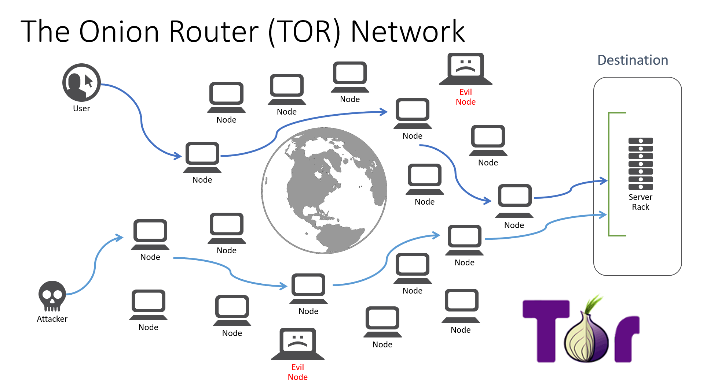

# Recursos de Hacking Ético

## 7.1 Conceptos básicos

### Tunelización de protocolos

Básicamente consiste en meter un protocolo dentro de otro. Por ejemplo, pongamos la situación de que desde una red interna no está permitido usar el protocolo SSH hacia fuera ya que hay un firewall que lo filtra. Lo que podríamos hacer es usar el protocolo HTTP y enviar a través del protocolo HTTP el tráfico SSH. Para ello tendríamos que tener un servidor HTTP que sepa que el tráfico que llega por HTTP lo tiene que redirigir a SSH.

### Servidor proxy

Es un servidor que hace de intermediario entre otro servidor. Esto sirve para que el servidor de destino no sepa el origen de una conexión ya que solo vería la dirección del proxy y no la nuestra. Es muy común hacer una encadenación de proxies para ocultarlo aún más. Incluso si se utilizan servidores de distintos países dificulta aún más el rastreo. Imaginemos que encadenamos un servidor proxy de Estados Unidos con otro servidor proxy de China. Sería bastante difícil que cada uno facilite la información de su servidor. Esto se conoce como proxychains.

### VPN

Básicamente es una conexión punto a punto. Todo el tráfico desde nuestro ordenador hacia el servidor va cifrado, lo que imposibilita el leer la información que se transfiere. Esto es muy común en empresas y es una buena solución cuando estamos usando una red wifi pública. También se puede usar para hacer escaneo de puertos ya que también nos oculta a través de la VPN, es decir, no se hace desde nuestro ordenador directamente. Además, muchos servicios de VPN permiten usar VPNs que están en distintos países y esto nos viene bien cuando queremos hacer escaneos de puertos y nos bloquean ya que podremos cambiar de país y probar otra vez. También hay empresas que bloquean el tráfico que proviene desde distintos países y usar un servicio de VPN nos puede facilitar saltarnos este filtrado.

### Redes de anonimización

Son redes muy potentes que nos permiten mantener el anonimato en internet y que hacen uso de los términos mencionados arriba. Algunas de las redes más famosas son TOR, FreeNet y I2P.

### TOR

Es una de las redes por excelencia de anonimización. Simplemente, hay que instalarse Tor, el cual se conecta a una red interna a través del nodo de entrada y la información va saltando por multitud de nodos donde ninguno de los nodos guarda logs. De esta forma es muy difícil recuperar la trazabilidad del tráfico que se ha realizado. El tráfico siempre va cifrando entre los nodos intermedios y llegaríamos al último nodo de salida el cual sacará nuestro tráfico a Internet. Se puede saber que el tráfico ha salido de la red Tor pero no quién lo ha hecho.

El tráfico se cifra tantas veces como nodos haya en el recorrido hasta la salida. Es decir, si pasamos por 3 nodos el mensaje va a ser cifrado 3 veces. El primer nodo quitaría la primera capa de cifrado, el segundo la segunda y el tercero la última. Cada capa de cifrado se cifra con claves distintas. El problema de esto es que el último nodo ve sin cifrar el mensaje y si el atacante ha hecho alguna acción que pudiese identificarle como por ejemplo un login a una red social podría identificarlo.

### FreeNET

La diferencia principal con Tor es que no nos anonimiza en Internet ya que si que deja entrar en la red pero el tráfico hacia Internet no sale de esa red sino de tu ordenador. Además, la información que hay en esa red se va replicando en distintos servidores por lo que es complicado borrar una información de la red FreeNET.

### I2P

Es prácticamente igual que FreeNET. El objetivo no es mantener el anonimato de la persona que navega sino mantener el anonimato de las personas que envían cierta información y permitir el acceso a dicha información.

[Volver al inicio](./../../README.md)
