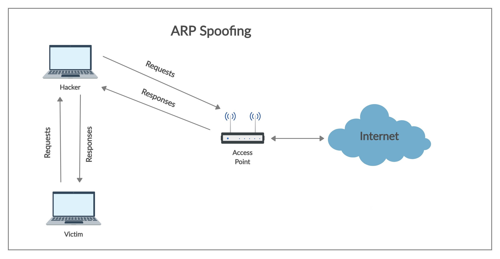
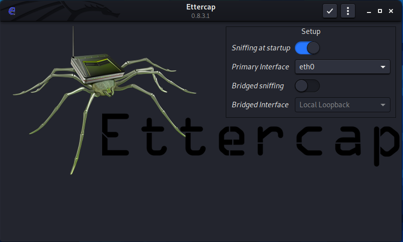
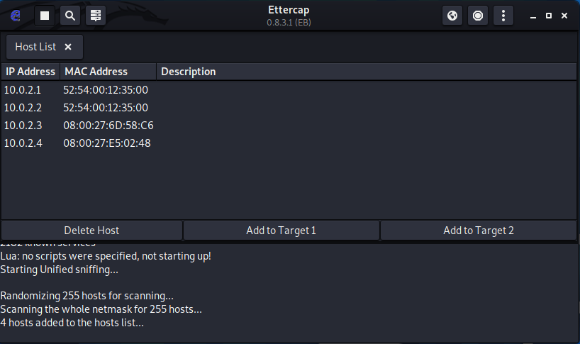
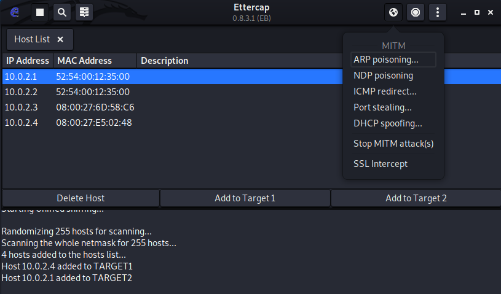
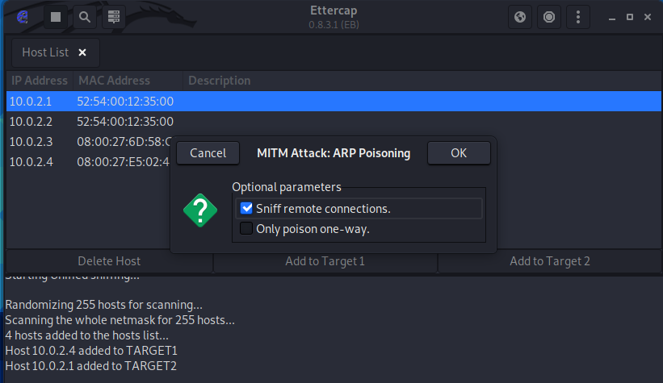
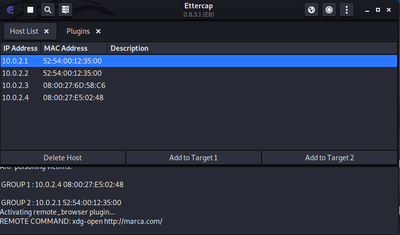

# Recursos de Hacking Ético

## ARP Spoofing

Un ataque de ARP Spoofing se trata de intentar suplantar la identidad de otro dispositivo de la red para obtener los paquetes que envía un dispositivo. Por ejemplo, si nos hacemos pasar por la puerta de enlace de una red podríamos monitorizar las peticiones que hace a internet uno de los dispositivos de la red. Para ello existe varias herramientas como Ettercap que nos facilita esta tarea y además tiene interfaz gráfica o `arpspooof` en la línea de comandos.

Si combinamos alguna de estas herramientas con algún sniffer podemos analizar los datos que fluyen por nuestro ordenador hacia el gateway para ver que peticiones está haciendo un usuario o incluso modificar las respuestas.

### Ettercap

Ettercap es una herramienta con interfaz gráfica para hacer ARP spoofing que viene por defecto con Kali Linux.
Para empezar debemos abrir la aplicación y nos aparecerá lo que ves en la siguiente imagen:

Simplemente seleccionamos nuestra interfaz de red y le damos al icono de "check" arriba.

Después tenemos que buscar los hosts sobre los que queremos hacer arp spoofing. En mi caso va a ser la máquina 10.0.2.4 y el gateway que es 10.0.2.1:

Una vez encontrados los hosts seleccionamos como target 1 la máquina 10.0.2.4 y como target 2 el gateway que es 10.0.2.1 y le damos al icono del mundo y a iniciar ARP poisoning:

Se nos abrirá un modal donde le daremos a OK y se iniciará el ARP spoofing. A partir de ese momento las peticiones que hagamos desde la máquina 10.0.2.4 pasarán a través de nuestro Kali Linux:

Ettercap viene con varios plugins y uno de ellos, `remote_browser_plugin`, sirve para ver las peticiones que está haciendo la máquina. Desde la máquina 10.0.2.4 he hecho un curl a marca.com para probar que todo está bien y como vemos en la siguiente imagen está funcionado ya que en los logs nos aparece la petición que se ha hecho:

[Volver al inicio](./../README.md)

