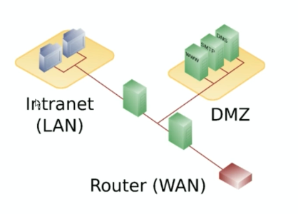
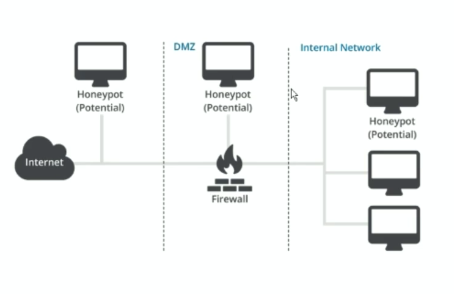

# Recursos de Hacking Ético

## 2. Principales dispositivos de seguridad

### Firewall

Básicamente es un software o firewall que divide dos redes para proteger una una red protegida de una red no protegida y pública. Tienen la capacidad de monitorizar y filtar el tráfico entrante y saliente para prevenir el acceso a la red protegida

### Red desmilitarizada (DMZ)

Es una red accesible desde internet y que está dentro de nuestra red interna pero a su vez está aislada del resto de los servidores de una organización. Por ejemplo:

Un atacante podría entrar por el punto rojo (Internet) y solo podría acceder a la DMZ si superase el primer firewall (punto verde). Los servidores de la DMZ no tienen acceso a la red interna (Intranet) por lo que únicamente podría tomar control de los servidores que se encuentran en la DMZ. También solo se puede acceder a través de ciertos puertos específicos, por ejemplo el puerto 80 y 443, de ésta forma la conexiones que vengan desde Internet el primer firewall debería filtrarlas al servidor que se encuentra en la DMZ.

### Honeypot

Es un equipo desplegado en una red y el cual es bastante vulnerable. Funciona a modo de cebo para que el atacante empiece por ese equipo ya que es bastante vulnerable y así conseguirle hacer perder tiempo para que nosotros podamos identificar al atacante, ver que intenciones tiene, etc...

### Sistema de detección de intrusos (IDS)

Es un software o hardware que se encarga de monitorizar el comportamiento de los usuarios para detectar accesos no autorizados o comportamientos potencialmente maliciosos. Hay de dos tipos:

* NIDS: detectan comportamientos maliciosos en la red
* HIDS: detectan comportamientos maliciosos en el host

### Firewall de aplicación web (WAF)

Es un firewall que se pone delante de una aplicación web y que observa todo el tráfico que le llega a la aplicación para identificar si la aplicación web está recibiendo algún ataque o no y en caso positivo cortar ese ataque.

### Data Lost Prevention (DLP)

Tienen como objetivo evitar que se saque información de un sistema analizando lo que está pasando en la red identificando la información que se mueve por la misma.

[Volver al inicio](./../README.md)
