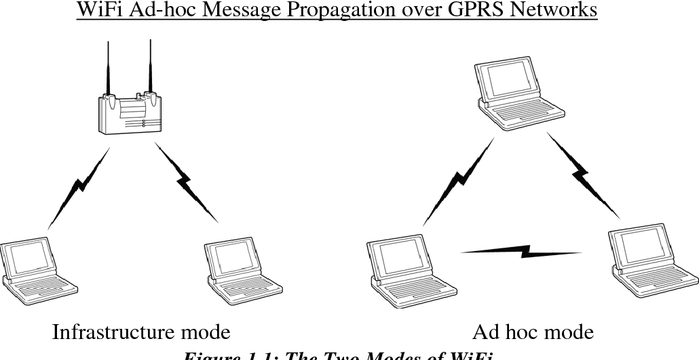
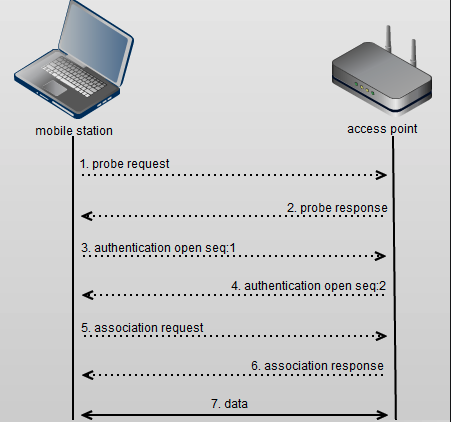

# Recursos de Hacking Ético

## Redes inalambricas: Wi-Fi

### Tipos de redes Wi-Fi

Vamos a ver dos tipos de redes Wi-Fi. La primera no es muy común y menos en empresas, hablamos de las redes ad hoc. Una red ad hoc es una red en la que no existe ningún switch o routing central. Es decir cada dispositivo se comunica directamente con otro dispositivo. Cuando un dispositivo se une a una de estas redes el dispositivo comparte su información con todos los demás para saber como se tienen que conectar los demás dispositivos con el si es necesario.

El otro tipo de red Wi-Fi es la que se conoce como *wireless infrastructure network* y a diferencia con el otro tipo de red si que tiene un dispositivo central el cual actúa como switch y los dispositivos no pueden hablar entre ellos directamente.

### Autenticación en una red Wi-Fi

Hay varias formas de autenticacion en las redes Wi-Fi. La primera que vamos a ver es cuando un cliente se asocia con una red. Para que esto pase primero el dispositivo tendrá que enviar algunas señales para comprobar que redes hay cerca suya. Cuando vemos que aparecen varios nombres de redes, por ejemplo `NO TE CONECTES A MI WIFI` eso es el SSID. De hecho, el nombre de una red no tiene porque ser único y para evitar colisiones lo que se utiliza por debajo es el BSSID (base service set identifier).

Si la red a la que nos queremos conectar está abierta el proceso de unirse a ella es muy fácil. Básicamente el cliente manda una petición de autenticación y el punto de acceso responde con un mensaje de éxito y esto hará que el cliente pase al siguiente paso. Una vez que el cliente se ha autenticado se tiene que asociar el cliente con la red. En este paso el cliente manda la información que tiene, por ejemplo, versión o la velocidad que soporta. Esto es importante para saber como el dispositivo y el punto de acceso tienen que hablar entre ellos.

[Volver al inicio](./../../README.md)
